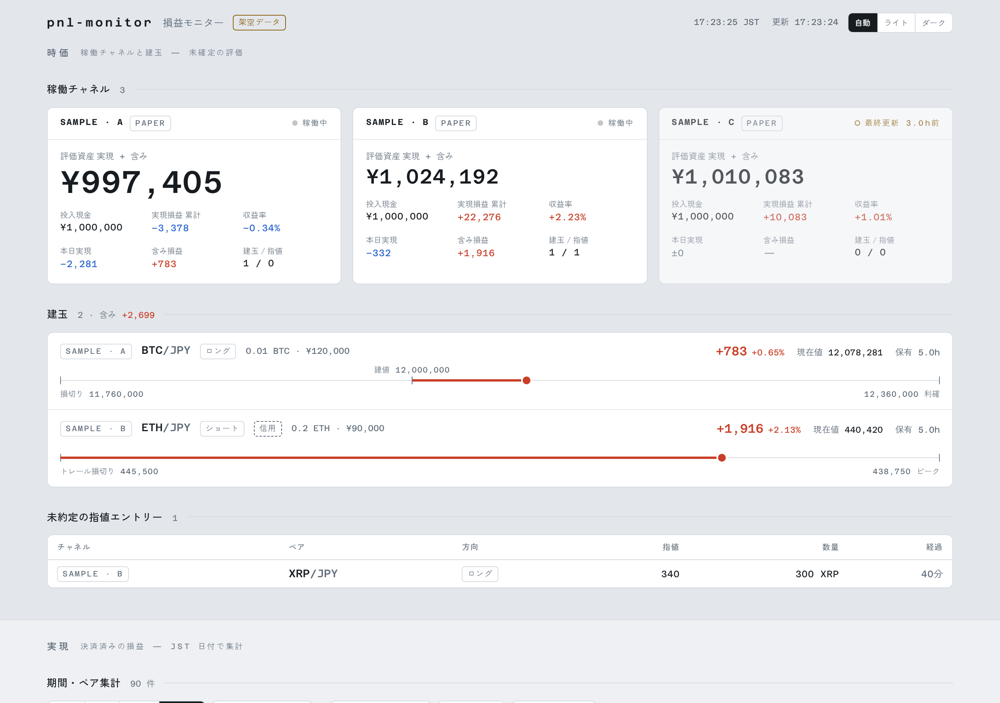

# react-pnl-monitor

React + TypeScript + Vite + Tailwind CSS v4 で作った、損益モニターのサンプルです。仮想通貨の取引を想定した架空のデータで動きます。

> 画面の数字はすべて架空のデータです。実在の口座・取引・相場とは関係ありません。

**デモ:** https://yohakucode.github.io/react-pnl-monitor/ （ブラウザでそのまま動きます）

**解説記事:** [React + Vite + Tailwind CSS で損益モニターを作る、入門の次の5つのポイント](https://zenn.dev/yohakucode/articles/react-vite-tailwind-pnl-monitor)（Zenn）



## 画面でできること

- 戦略（チャネル）ごとの評価資産と、建玉の目盛り（損切り・建値・現在値・利確）の表示
- 期間・ペア・チャネルでの絞り込みと、合計損益・勝率・平均損益の集計
- 累積損益のグラフ（グラフのライブラリを使わず SVG で描画）
- ライト・ダークの切り替えと、端末の設定への追従
- スマホ幅での1列表示

## 動かし方

Node.js 20.19 以上、または 22.12 以上が必要です。

```bash
npm ci
npm run dev
```

表示された URL をブラウザで開きます。

ビルドは `npm run build` で、結果は `dist/` に出ます。`vite.config.ts` で `base: "./"` にしているので、`dist/` はどのパスに置いても開けます。

## 本物のデータにつなぐ

`src/api.ts` の `fetchStatus` と `fetchTrades` が、`src/demo.ts` の架空データを返しています。ここを `fetch` でサーバーから取る形に差し替えます。受け取るデータの型も `src/api.ts` にあります。

この画面には認証がありません。本物の損益を出すときは、外から見えない場所で動かしてください。

## ファイル構成

```text
src/
├── App.tsx               画面全体の並び
├── index.css             色・書体・表の共通スタイル
├── api.ts                データの型と取得関数
├── demo.ts               架空データ
├── format.ts             金額・時刻の整形
├── hooks/                定期取得、ライト・ダークの切り替え
└── components/           画面の部品
```

## ライセンス

コードは [MIT License](LICENSE) です。

英数字の書体 Azeret Mono は SIL Open Font License 1.1 で、`@fontsource/azeret-mono` からビルドに含めています。和文の書体 Zen Kaku Gothic New は Google Fonts から読み込みます。
